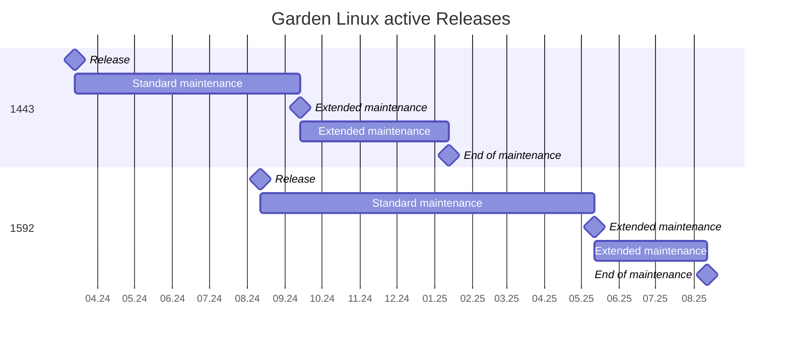

# Query Garden Linux Releases

This guide shows how to use `glrd` to retrieve release information from the Garden Linux Release Database (GLRD).

## Prerequisites

- `glrd` installed. See [Run GLRD](/how-to/glrd-run.md).
- A network connection to the GLRD Amazon S3 bucket (default input source).

To use local release files instead of the S3 endpoint, add `--input-type file` to any command. See the [CLI reference](/reference/supporting_tools/glrd/cli.md) for all available input flags.

## Get the latest release

Get the latest active minor release with default shell output:

```bash
glrd --latest
```

Example output:

```text
Name            Version  Type    GitCommitShort    ReleaseDate    ExtendedMaintenance    EndOfMaintenance
minor-1592.6     1592.6  minor   cb05e11f          2025-02-19     N/A                    2025-08-12
```

## Get only the version number

Use `--fields` and `--no-header` to extract a single field for scripting:

```bash
glrd --latest --fields Version --no-header
```

Example output:

```text
1592.6
```

## Get JSON output

Use `--output-format json` to retrieve the full release object:

```bash
glrd --latest --output-format json
```

The JSON output includes all schema fields for the release, including `version`, `lifecycle`, `git`, `github`, `flavors`, `oci`, and `attributes`. See the [GLRD Release Schema](/reference/supporting_tools/glrd/schema.md) for field definitions.

:::info Version note
For v2 releases (major ≥ 2017.0.0), the `version` object includes a `patch` field. For v1 releases (major < 2017.0.0), no `patch` field is present.
:::

## Extract a version string from JSON output

Pipe JSON output to `jq` to extract a specific field:

```bash
glrd --latest --output-format json | jq -r '.releases[] | "\(.version.major).\(.version.minor)"'
```

Example output:

```text
1592.6
```

For v2 releases, include the patch component:

```bash
glrd --latest --output-format json | jq -r '.releases[] | "\(.version.major).\(.version.minor).\(.version.patch)"'
```

## List all active releases

Show all currently active major and minor releases (end-of-life date in the future):

```bash
glrd --active
```

Example output:

```text
Name             Version  Type    GitCommitShort    ReleaseDate    ExtendedMaintenance    EndOfMaintenance
major-1443       1443     major   N/A               2024-03-13     2024-09-13             2025-01-13
minor-1443.15    1443.15  minor   5d33a69           2024-10-10     N/A                    2025-01-13
major-1592       1592     major   N/A               2024-08-12     2025-05-12             2025-08-12
minor-1592.1     1592.1   minor   ec945aa           2024-08-22     N/A                    2025-08-12
```

## Filter by release type

Show only nightly releases:

```bash
glrd --type nightly
```

Show major and next releases:

```bash
glrd --type major,next
```

## Filter by version

Show all releases for a specific major version:

```bash
glrd --version 1592
```

Show a specific minor release:

```bash
glrd --version 1592.6
```

## Generate a Mermaid Gantt chart

Use `--output-format mermaid_gantt` to produce a [Mermaid Gantt chart](https://mermaid.js.org/syntax/gantt.html) of active releases. This is useful for embedding in documentation or dashboards.

```bash
glrd --active --type next,major --output-format mermaid_gantt --output-description "Garden Linux active Releases"
```

Example output:



## Query from a local file

To run `glrd` without network access, download the JSON files first and point `glrd` at them:

```bash
# Download release data
curl -s https://gardenlinux-glrd.s3.eu-central-1.amazonaws.com/releases-major.json -o releases-major.json
curl -s https://gardenlinux-glrd.s3.eu-central-1.amazonaws.com/releases-minor.json -o releases-minor.json

# Query from local files
glrd --input-type file --latest
```

## Related topics

<RelatedTopics />
